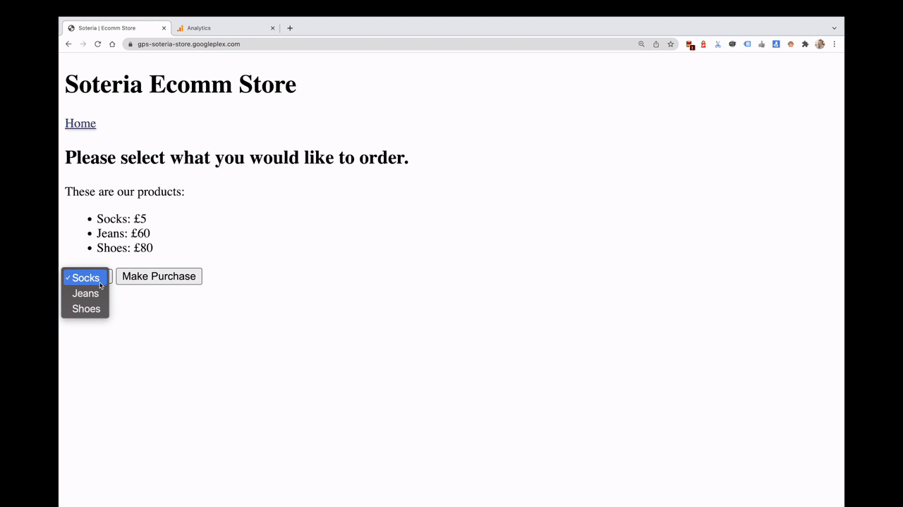

# gPS Soteria

_Real-time value based bidding with Google Ads products, that keeps sensitive
data away from determined end users._

Use [Server Side Google Tag Manager (sGTM)](
https://developers.google.com/tag-platform/tag-manager/server-side) with
[Firestore](https://cloud.google.com/firestore), to pull in sensitive profit
data (or other sensitive data) and report it to the Google Ads products in place
of revenue as the conversion value. This enables profit bidding, with real time
conversion uploads, in a way that protects the sensitive profit data from a
determined user.

## Background
Value Based Bidding (VBB) is one of the core topics for many clients. There are
different levels of maturity with VBB: clients tend to start with a revenue
value, and implement [tROAS bidding](
https://support.google.com/google-ads/answer/6268637?hl=en-GB), but as they
mature they will move to using a profit or LifeTime Value (LTV) in place of
revenue.

Both profit and LTV are sensitive metrics, therefore most clients would not like
a determined user to be able to access this information. As a result, clients
will tend to either use a proxy value in its place or implement a batch upload
strategy using one of the APIs. The former complicates reporting and some
clients are uncomfortable with this approach. The latter poses issues due to the
lack of support for conversion modelling, and some worry about the impact on
bidding, caused by the delay in reporting the conversions in batches.

sGTM has feature parity for modelling with the client side JavaScript tag, it
happens in real time, and enables pulling in external "sensitive" data, so it
operates in the sweet spot between the two existing approaches.

## Why Soteria?

[Soteria](https://en.wikipedia.org/wiki/Soteria_(mythology)) was the Greek
Goddess of safety, and deliverance and preservation from harm. Like the goddess,
this project provides safety from end users to your sensitive value data (e.g.
profit).

## Disclaimer
__This is not an officially supported Google product.__

Copyright 2022 Google LLC. This solution, including any related sample code or
data, is made available on an "as is", "as available", and "with all faults"
basis, solely for illustrative purposes, and without warranty or representation
of any kind. This solution is experimental, unsupported and provided solely for
your convenience. Your use of it is subject to your agreements with Google, as
applicable, and may constitute a beta feature as defined under those agreements.
To the extent that you make any data available to Google in connection with your
use of the solution, you represent and warrant that you have all necessary and
appropriate rights, consents and permissions to permit Google to use and process
that data. By using any portion of this solution, you acknowledge, assume and
accept all risks, known and unknown, associated with its usage, including with
respect to your deployment of any portion of this solution in your systems, or
usage in connection with your business, if at all.
