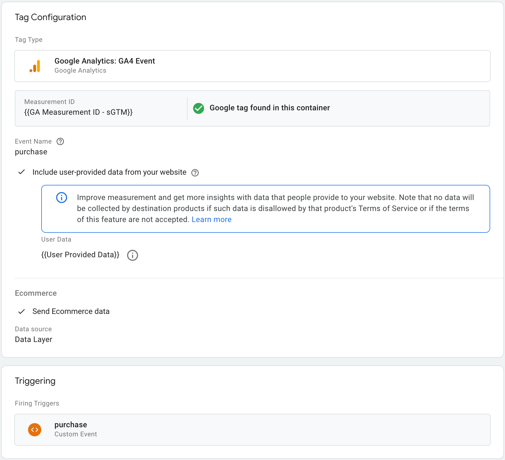
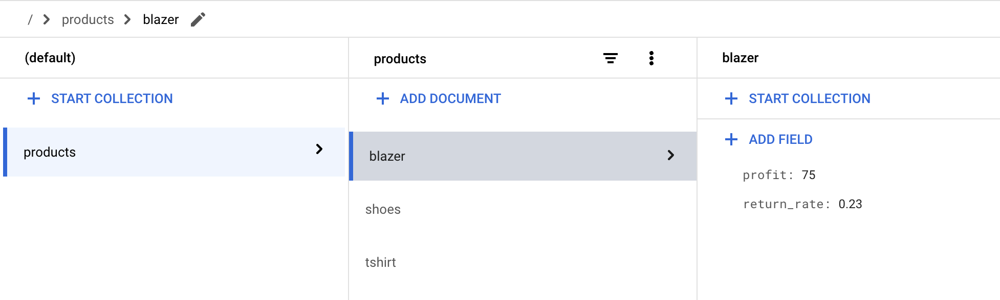

# gPS Soteria
## Value Based Bidding with Sensitive Data, using Server Side Google Tag Manager & Firestore


- [Overview](#overview)
- [Background](#background)
- [Prerequisites](#prerequisites)
- [Architecture](#architecture)
- [Demo](#demo)
- [Solution Details](#solution-details)
  - [Website](#website)
  - [GTM Web Container](#gtm-web-container)
  - [Firestore](#firestore)
  - [Server Side GTM](#server-side-gtm)
    - [Overview](#overview-1)
    - [Set up](#set-up)
      - [Auth](#auth)
      - [Google Tag Manager](#google-tag-manager)
- [Value Calculation](#value-calculation)
  - [Using AI in place of Firestore](#using-ai-in-place-of-firestore)
- [Disclaimer](#disclaimer)

## Overview

This document outlines how
[Server Side Google Tag Manager](https://developers.google.com/tag-platform/tag-manager/server-side)
(sGTM) can be used with [Firestore](https://cloud.google.com/firestore), to pull
in sensitive profit data (or other sensitive data) and report it to Google
Analytics and Google Ads in place of revenue as the conversion value. This enables
a client to bid to profit, with real time conversion uploads, in a way that
protects the sensitive profit data from a determined user.


##### *Gif 1*

_It should be noted in this demo that we’re changing the e-commerce event
conversion value to the profit. If your intention is to use this with bidding,
this is a reasonable approach, but be aware that Google Analytics will label the
profit as “revenue” in the UI, if you’re using e-commerce events. The solution
provides you with full control of where you report this, so you may need to
consider which value you use if your goal is to leverage Soteria for reporting
purposes._

## Background

Value Based Bidding (VBB) is one of the core topics for many clients. There are
different levels of maturity with VBB: clients tend to start with a revenue
value, and implement
[tROAS bidding](https://support.google.com/google-ads/answer/6268637?hl=en-GB),
but as they mature they will move to using a profit or LifeTime Value (LTV) in
place of revenue.

Both profit and LTV are sensitive metrics, therefore most clients would not like
a determined user to be able to access this information. As a result, clients
will tend to either use a proxy value in its place or implement a batch upload
strategy using one of the APIs. The former complicates reporting and some
clients are uncomfortable with this approach. The latter poses issues due to the
lack of support for conversion modelling, and some worry about the impact on
bidding, caused by the delay in reporting the conversions in batches.

sGTM has feature parity for modelling with the client side JavaScript tag, it
happens in real time, and enables pulling in external “sensitive” data, so it
operates in the sweet spot between the two existing approaches.

This document outlines how a client could use sGTM to replace revenue with
profit, on a “purchase” event, and send it to Google Analytics, in a way that
protects that sensitive data.

## Prerequisites

-   Server Side Google Tag Manager
-   Access to a Google Cloud project with Firestore in
    [Native mode](https://cloud.google.com/datastore/docs/firestore-or-datastore)
-   Access to product level profit data in advance of a transaction
-   Google Analytics or Google Ads for conversions

## Architecture

[Image 1](#image-1) provides a high level overview of the core components
involved, and outlines the flow. This is high level, please see
[solution details](#solution-details) for further information.


##### *Image 1*

<br>

1.  A GTM web container is used to set up tagging on the site, and is configured
    with a “purchase” event.
2.  The client’s website is set up to have an
    [e-commerce purchase event](https://developers.google.com/analytics/devguides/collection/ga4/ecommerce?client_type=gtag#purchase)
    in the data layer: this contains the revenue data. When a purchase is made,
    the event fires, sending the payload to sGTM.
3.  A custom variable is attached to a tag, triggered by “purchase” events,
    which pulls profit data from Firestore and replaces the revenue conversion
    value with the profit.
4.  The updated event (with profit conversion value) is sent to Google
    Analytics or Google Ads.

## Demo

As seen in [gif 1](#gif-1), on a demo website there are three products a user
can purchase. These can be seen below in table 1, along with the average profit
for each of the items.

The revenue value is displayed to the user, and the average profit for each of
these items is stored in a separate document in a Firestore collection.

| Product | Revenue | Profit |
|   :-:   |   :-:   |   :-:  |
|  socks  |    £5   |    £3  |
|  jeans  |   £60   |   £10  |
|  shoes  |   £80   |   £40  |

##### *Table 1*

<br>

On our demo site, after purchasing a pair of socks this is what we can see in
the source code: 

##### *Image 2*

<br>

In the data layer we can see a `purchase` event, with a transaction ID of
`36329aa4-af5e-4ac9-9ee7-c6fbcc93187d`, the total basket value is 5 and the item
price is 5. This is all a determined user would be able to see.

In our Google Tag Manager server container, we have a custom variable that swaps
the basket revenue value for the profit, and reports the data to Google
Analytics.

In the Google Analytics UI we can see that the item revenue is unchanged at £5.
However, we've replaced the basket value with the profit of £3.


##### *Image 3*

<br>

We can then configure Google Analytics to use the basket value as a conversion,
which can be imported into an ad product and used in bidding. Thus, enabling
profit bidding without the profit value ever being on the page for a user to
see.

## Solution Details

### Website

In the data layer, in the HTML of the “thank you for your order” page, a
purchase event is configured. This follows the
[schema outlined in the docs](https://developers.google.com/analytics/devguides/collection/ga4/ecommerce?client_type=gtag#purchase).

```html
<script>
  dataLayer.push({ ecommerce: null });  // Clear the previous ecommerce object.
  dataLayer.push({
    event: "purchase",
    ecommerce: {
        transaction_id: "4aae7190-149b-44c4-b095-ec49f9372ba5",
        value: 5,
        currency: "GBP",
        items: [{
          item_id: "socks",
          item_name: "Socks",
          price: 5,
          quantity: 1
      }]
    }
  });

</script>
```

##### *Code 1*

<br>

### GTM Web Container

There is nothing special about the Google Tag Manager web container set up. In
this demo, a GA4 configuration is set up to send events to our server container,
see [image 4](#image-4).


##### *Image 4*

<br>

A purchase event is then configured, see [image 5](#image-5).



##### *Image 5*

<br>

### Firestore

There is a requirement to use Firestore Native, if you've already used Datastore
mode, then you'll have to create a new project and store profit data for each
product in a Firestore document
([read more](https://cloud.google.com/datastore/docs/firestore-or-datastore)).

The recommended way is to set each Firestore document ID to the product ID, this
way it's easy to fetch the right document by a single lookup.

First create a `products` collection, then add documents to this collection for
each product. These documents should have a field with the profit value.

The Firestore collection name, and document field can be set when setting up the
variable in sGTM.


##### *Image 6*

<br>

### Server Side GTM

#### Overview

This is where the magic happens: the data layer in the HTML (see
[code 1](#code-1) and/or [image 2](#image-2)) contains the revenue value. In the
server side container the revenue value is swapped for the profit value, which
is pulled from Firestore, by using a custom
“[profit variable template](./../src/gtm/firestore-value-template.tpl)”.

An overview of the sGTM flow can be seen below.


1.  The purchase event triggers the Analytics tag and/or the Google Ads Conversion tag.
2.  The tag has a custom profit variable attached to it to replace the
    conversion value.
3.  The profit variable uses a custom variable template
    ([see code](./../src/gtm/firestore-value-template.tpl)) to fetch the profit
    data from Firestore and sum the total profit for all purchased items.
4.  The event is reported to Google Analytics and/or Google Ads and/or
    Floodlight with the updated conversion value.

#### Set up

##### Auth

If the server side container is deployed to App Engine or Cloud Run, then Google
Tag Manager will use the service account attached to the instance for connecting
to Firestore.

If the server side container is deployed in a different Cloud provider to Google
Cloud, please [follow these additional instructions](
https://developers.google.com/tag-platform/tag-manager/server-side/manual-setup-guide#optional_include_google_cloud_credentials)
to attach a Google Cloud service account to the deployment.

This service account needs to have permission to access the Firestore data.

1. Open the [IAM Service Accounts page](
   https://console.cloud.google.com/iam-admin/serviceaccounts) in the Google
   project that contains the sGTM container, and make a note of the service
   account email.
   
2. Open the [IAM page](https://console.cloud.google.com/iam-admin/iam) for the
   Firestore project, and press grant access.
   
3. Add the service account email from step 1, and assign it the `Cloud Datastore
   User` role ([docs](
   https://cloud.google.com/iam/docs/understanding-roles#datastore-roles)).
   


##### Google Tag Manager

1. Go to the server side container in
    [tagmanager.google.com](https://tagmanager.google.com/).
2. Go to templates -> new variable template.
3. Click on the three-dot menu on the top right and choose `Import`.
4. Select the [`firestore-value-template.tpl`](
   ./../src/gtm/firestore-value-template.tpl) file.
5. Go to the permission tab and set the permissions for Firestore, ensuring you
   update the project ID.
   
6. Save the template.
7. Go to variables -> new user defined variable and create a “profit” variable
   from the profit variable template.
8. Go to tags -> new:
    - **Google Analytics:** Select an Analytics tag and in the “parameters to
    add / edit” section replace value with the profit variable.
    
    - **Google Ads:** Select a Google Ads Conversion Tracking tag and in the
    configuration add the profit variable to the 'Conversion Value' field.
    
    - **Floodlight:** Select a Floodlight tag and in the configuration, set
    'Custom configuration' as the 'Data Source' and add the profit variable to
    the 'Revenue' field.
    
9. The trigger should be a custom event for purchase events.
10. Save and deploy the code.


## Value Calculation

There are different methods for calculating the value built into the tag.

- `Value`: This is the default method. The calculation is simply:
  ```
  conversion_value = profit * quantity
  ```
- `Return Rate`: If some products are returned more than others, you could
  calculate the return rate percentage at a product level.

  Then in Firestore you can add the document with both the profit and return
  rate:

  

  ```
  conversion_value = (1 - return_rate) * profit * quantity
  ```
  If you select this field, you can optionally override the name of the return
  rate field in Firestore.
- `Value with Discount`: Discounts could impact your profit value, and these might
  be applied at a transaction level. If you use [the discount](
  https://developers.google.com/analytics/devguides/collection/ga4/reference/events?client_type=gtag#purchase)
  attribute in the items array, you could use this calculation method:
  ```
  conversion_value = (profit - discount) * quantity;
  ```

> Tip 💡: If you would like to write your own value calculation, you can do that
by adding an additional option to the dropdown after importing the tag in tag
manager, and by extending the switch statement in the `calculateValue()` method
to handle your custom approach.

### Using AI in place of Firestore

If you're interested in leveraging an AI model instead of static lookups in
Firestore, then consider the [Phoebe solution on Github](
https://github.com/google/gps-phoebe).

## Disclaimer

Copyright 2024 Google LLC. This solution, including any related sample code or
data, is made available on an “as is,” “as available,” and “with all faults”
basis, solely for illustrative purposes, and without warranty or representation
of any kind. This solution is experimental, unsupported and provided solely for
your convenience. Your use of it is subject to your agreements with Google, as
applicable, and may constitute a beta feature as defined under those agreements.
To the extent that you make any data available to Google in connection with your
use of the solution, you represent and warrant that you have all necessary and
appropriate rights, consents and permissions to permit Google to use and process
that data. By using any portion of this solution, you acknowledge, assume and
accept all risks, known and unknown, associated with its usage, including with
respect to your deployment of any portion of this solution in your systems, or
usage in connection with your business, if at all.
