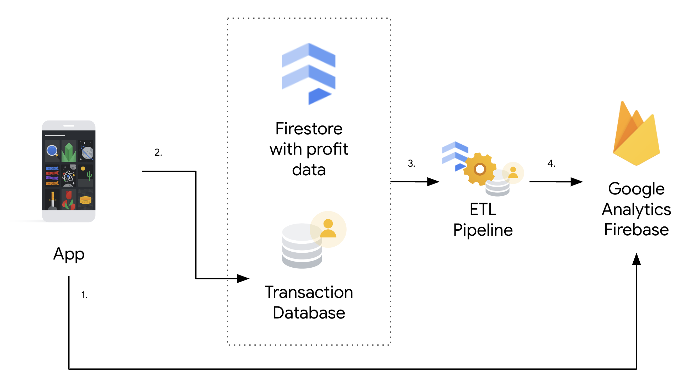
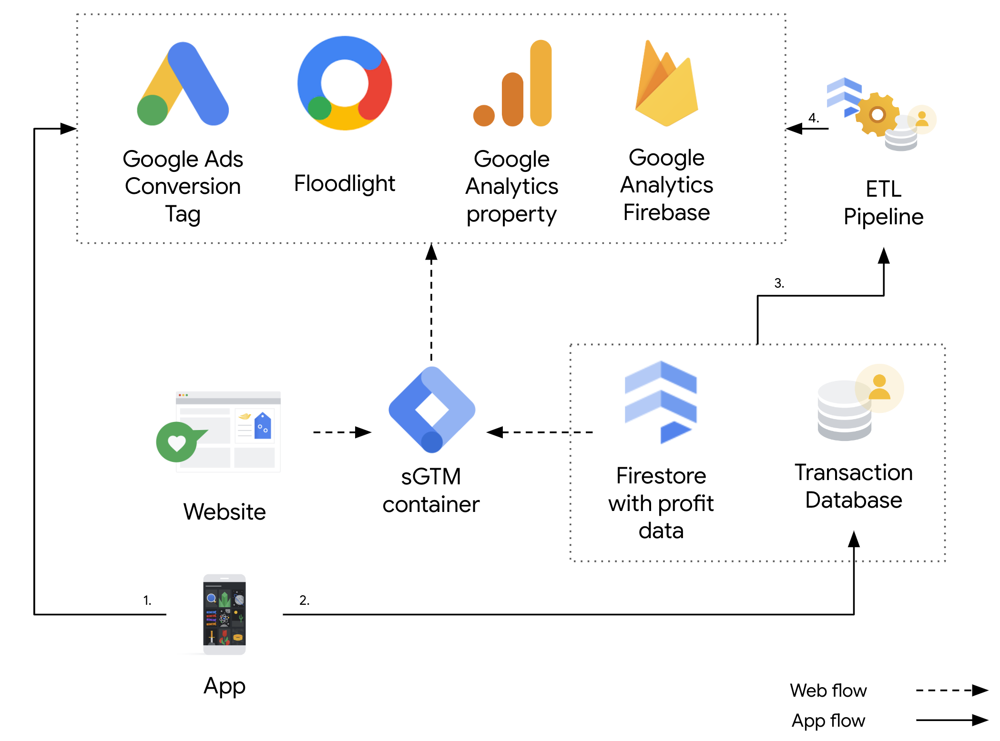

# Value Based Bidding for Mobile Apps (Pre-sGTM App Support)

Server-side Google Tag Manager (sGTM) doesn't currently offer direct support for
mobile apps, but it's still possible to implement value based bidding strategies
for your app, even with sensitive conversion values like profit. This guide
outlines how to achieve this using [Firebase](https://firebase.google.com/) and
[Measurement Protocol](
https://developers.google.com/analytics/devguides/collection/protocol/ga4).

> ⚠️ This is a guide with a proposed architecture, not a deployable solution.

## Overview
The core idea is to track purchase events in your app using the [Firebase SDK](
https://firebase.google.com/docs/firestore/client/libraries), then send these
transactions to an internal database. An ETL (Extract, Transform, Load) tool can
then enrich this data with profit information. Finally, the Measurement Protocol
is used to send these enriched conversions back to Firebase, enabling value
based bidding.

## Architecture
The below architecture diagram looks at the mobile conversion pipeline in
isolation.

1. **Track Purchases:** Implement Firebase Analytics in your app to track
  purchase events, including revenue information.
2. **Store Transactions:** Send the transaction data to an internal database
  where you can securely store and manage it.
3. **Enrich with Profit:** Use an ETL tool (e.g. [Dataflow](
  https://cloud.google.com/dataflow)) to join your transaction data with profit
  data from your internal systems.
4. **Report to Firebase:** Use [Measurement Protocol](
  https://developers.google.com/analytics/devguides/collection/protocol/ga4) to
  send the enriched conversion data (including profit) back to Firebase ([also
  see this colab](https://firebase.google.com/codelabs/firebase_mp#0)).

> Important ❗️: The specific ETL tool and database will depend on your existing
> tech stack and infrastructure.

For a unified view of both the web and app flow, see below. The data flow is the
same as the regular Soteria data flow for web, and the above app flow.

